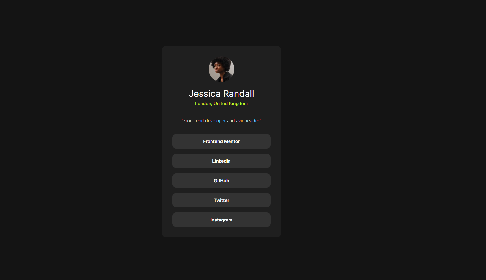

# Frontend Mentor - Social links profile solution

Ceci est ma solution au [défi "Social links profile"](https://www.frontendmentor.io/challenges/social-links-profile-UG32l9m6dQ) de Frontend Mentor.

## Table of contents

- [Overview](#overview)
  - [The challenge](#the-challenge)
  - [Screenshot](#screenshot)
  - [Links](#links)
- [My process](#my-process)
  - [Built with](#built-with)
  - [What I learned](#what-i-learned)
- [Author](#author)

## Overview

### The challenge

Les utilisateurs doivent pouvoir :
- Voir les états `hover` et `focus` sur les éléments interactifs

### Screenshot

### Links

- Solution URL: [https://github.com/LINDECKER-Charles/FM_SocialLinksProfile](https://github.com/LINDECKER-Charles/FM_SocialLinksProfile)
- Live Site URL: [https://fm-social-links-profile-olive.vercel.app/](https://fm-social-links-profile-olive.vercel.app/)

## My process

### Built with

- HTML5 sémantique
- Tailwind CSS via CDN
- Mobile-first design
- Font Inter (via `@font-face`)

### What I learned

- Personnalisation de Tailwind via CDN
- Utilisation de `@font-face` avec une police variable
- Accessibilité avec `itemscope` et `itemtype`

## Author

- LinkedIn - [Charles LINDECKER](https://www.linkedin.com/in/charles-lindecker/)
- Frontend Mentor - [@LINDECKER-Charles](https://www.frontendmentor.io/profile/LINDECKER-Charles)
